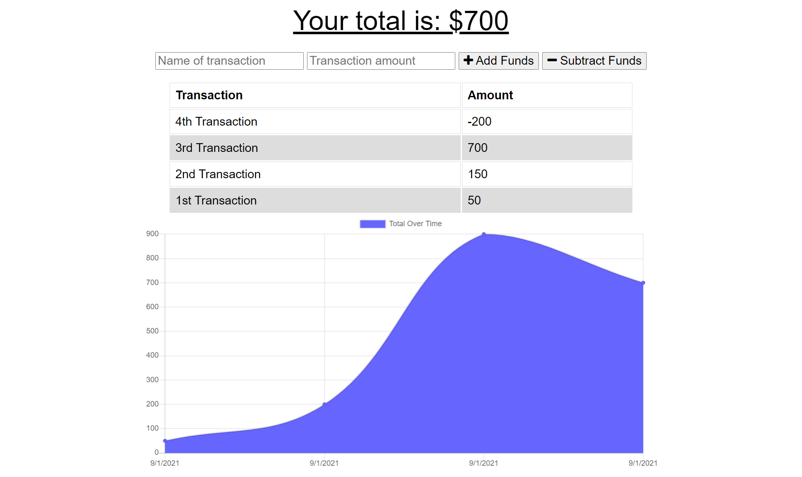

# Budget-Tracker-SMM

This project is a homework assignment for Rutgers Coding Bootcamp.

## Description

```
GIVEN a Budget Tracker without an internet connection
WHEN the user inputs an expense or deposit
THEN they will receive a notification that they have added an expense or deposit
WHEN the user reestablishes an internet connection
THEN the deposits or expenses added while they were offline are added to their transaction history and their totals are updated
```

## Table of Contents 

* [Technologies Used](#technologies-used)
* [Deploy](#deploy)
* [Usage](#usage)
* [Notes](#notes)
* [Contributions](#contributions)
* [Licenses](#licenses)


## Technologies Used

* JavaScript
* Node.js
* Express
* Mongoose
* MongoDB

## Deploy

[Heroku Link](https://desolate-mountain-30570.herokuapp.com/)

## Usage 

### Landing Page:




## Notes
Getting offline functionality to work was extremely difficult. I didn't realize that I needed to unregister the service worker if I was having issues with the offline functionality. 

## Contributions
N/A

## Licenses
N/A
